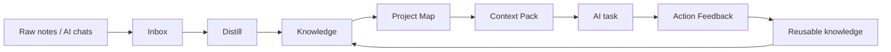

# Give Your AI Tools a Project Memory You Control

**A local-first Markdown system for turning notes, AI conversations, decisions, incidents, and feedback into reusable context for Claude, Codex, ChatGPT, and local LLMs.**

Local AI Knowledge OS is a lightweight Markdown system that turns scattered project notes, AI chats, decisions, incidents, and feedback into reusable context any AI tool can read. No app to install, no account, no lock-in — just a folder structure you copy and own.

---

## Start Here

New here? Follow this path top to bottom:

1. **Read the 2-minute method overview** → [docs/2026-06-07-method-overview.md](docs/2026-06-07-method-overview.md)
2. **Copy the starter kit** → [`starter-kit/10_AI_OS/`](starter-kit/10_AI_OS/)
3. **Create your first Project Map** → [template](templates/Project_Map_Template.md) · [example](examples/sample-project-map.md)
4. **Build one Context Pack** → [template](templates/Context_Pack_Template.md) · [example](examples/sample-context-pack.md)
5. **Run one AI task** with that Context Pack in Claude, Codex, ChatGPT, or a local LLM.
6. **Record Action Feedback** → [template](templates/Action_Feedback_Template.md) · [example](examples/sample-action-feedback.md)

That full cycle, start to finish, is shown in [examples/sample-memory-loop.md](examples/sample-memory-loop.md).

---

## Quick Start: Build Your First OS in 15 Minutes

You only need a folder and a text editor.

| Time | Step | What you do |
|------|------|-------------|
| 0–2 min | **Orient** | Skim the [method overview](docs/2026-06-07-method-overview.md) so the folders make sense. |
| 2–4 min | **Copy** | Copy [`starter-kit/10_AI_OS/`](starter-kit/10_AI_OS/) into your notes vault or any folder. |
| 4–8 min | **Map** | Open the [Project Map template](templates/Project_Map_Template.md), save a copy under `06_Projects/your-project/`, and fill in goal, status, and three next actions. |
| 8–11 min | **Pack** | Copy the [Context Pack template](templates/Context_Pack_Template.md) and write a small task for an AI — point it at your Project Map. (See the [example](examples/sample-context-pack.md).) |
| 11–14 min | **Run** | Paste the Context Pack into your AI tool of choice and let it do the task. |
| 14–15 min | **Feedback** | Record what happened with the [Action Feedback template](templates/Action_Feedback_Template.md). |

That's it — you now have a working knowledge OS your AI can read, and a habit that makes it better over time.

---

## How it works

Capture lands in the **Inbox**, gets processed in **Distill**, and durable insights become **Knowledge**. Each project has a **Project Map** as its front door. To run an AI task you assemble a focused **Context Pack**, act, then record **Action Feedback** — and the lessons flow back into Knowledge. The loop makes the system smarter, not just bigger.

---

## Who this is for

**Best for:**
- Solo founders
- AI consultants
- Indie hackers
- Technical writers
- Markdown / Obsidian users
- Claude / Codex / ChatGPT power users
- Small teams that need reusable project memory

**Not for:**
- People wanting a hosted SaaS
- A full CRM
- An automated vector database
- A generic productivity system

This is intentionally lightweight, local-first, and tool-agnostic. If you want a managed cloud product, this isn't it — and that's the point.

---

## How it compares

| | Local AI Knowledge OS | Obsidian | Notion | Prompt books | AI chat history | Generic AI productivity tools |
|---|---|---|---|---|---|---|
| **Local-first / you own the files** | ✅ Plain Markdown | ✅ | ❌ Cloud app | ❌ (it's a book) | ❌ Vendor-held | ❌ Usually cloud |
| **AI-readable by design** | ✅ Role-based structure | ⚠️ Notes for humans | ⚠️ DB for humans | ❌ | ⚠️ Transcript only | ⚠️ Varies |
| **Reusable project memory** | ✅ Project Maps + records | ⚠️ DIY | ⚠️ DIY | ❌ | ❌ Hard to retrieve | ⚠️ Tool-bound |
| **Captures *why* (decisions/incidents)** | ✅ Built-in templates | ❌ | ❌ | ❌ | ❌ | ❌ |
| **Works across many AI tools** | ✅ Claude/Codex/ChatGPT/local | ⚠️ | ⚠️ | ✅ (advice only) | ❌ One vendor | ❌ Usually one |
| **Offline / private option** | ✅ With local LLMs | ✅ | ❌ | ✅ | ❌ | ⚠️ |
| **Cost / lock-in** | ✅ Free, no lock-in | ✅ Mostly | ❌ | ✅ | ❌ Lock-in | ⚠️ |

The gap nobody else fills: **AI-readable, reusable project memory that you own and can use with any model.** Obsidian and Notion store notes for humans; prompt books teach phrasing; chat history is a transcript, not a memory. This system is the layer underneath all of them.

---

## ⚠️ Privacy first — please read

> **This is a public repository. Everything here is meant to be public-safe and reusable.**
>
> **Do NOT commit** private project data, customer data, business secrets, API keys, credentials, personal documents, or full AI conversation logs — here or in any AI-readable file.
>
> Keep private working data in a **local vault or a private repository**. All examples in this repo are **fictional and public-safe** (e.g. the "Example Local Website Project"). When you build your own OS, keep the public method separate from your private content.

---

## Explore the repository

- 📖 **Method overview** — [docs/2026-06-07-method-overview.md](docs/2026-06-07-method-overview.md)
- 🧰 **Starter kit** (copy this) — [starter-kit/](starter-kit/)
- 📐 **Templates** — [templates/](templates/) ([which one should I use?](templates/README.md))
- 🧪 **Examples** (fictional, public-safe):
  - [Sample Project Map](examples/sample-project-map.md)
  - [Sample Context Pack](examples/sample-context-pack.md)
  - [Sample Action Feedback](examples/sample-action-feedback.md)
  - [Sample Knowledge Note](examples/sample-knowledge-note.md)
  - [Sample Memory Loop (full cycle)](examples/sample-memory-loop.md)
- 📚 **Book companion planning** — [book/outline/](book/outline/)

---

## About the method and the book

This repository is the public companion to the **Semantic OS Method** and the forthcoming KDP book **Build Your Local AI Knowledge OS** — *A Practical System for Giving AI Tools Reliable Project Memory*.

The repo gives you the copyable structure, templates, and safe examples. The book explains the method in depth. **The full manuscript is private and not stored here.**

## License

No license has been selected yet. The text, templates, and methodology are currently shared for review and educational purposes only.
