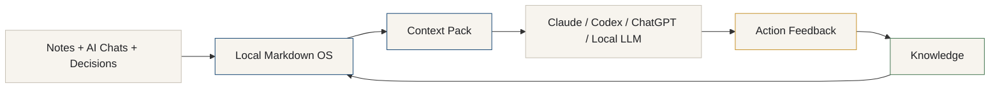

# Hero Diagram — AI Project Memory You Control

A one-glance picture of what the system does. If a first-time visitor reads only this, they should understand the product in about five seconds: your notes, chats, and decisions become a local Markdown memory that any AI tool can use — and the results flow back in as durable knowledge.

## What it shows

- **Notes + AI Chats + Decisions** — the scattered raw material you already produce.
- **Local Markdown OS** — a plain-text structure you own, on your machine.
- **Context Pack** — a focused bundle assembled for one task.
- **Claude / Codex / ChatGPT / Local LLM** — any AI tool reads the same context.
- **Action Feedback** — you record what actually happened.
- **Knowledge** — the lesson becomes durable and feeds back into the OS.

The arrow from Knowledge back to the OS is the point: the system gets smarter over time, and it never depends on a single AI tool's memory.

## Notes for future SVG/PNG export

- Canvas background: Paper `#F7F4EE`. Text/lines: Graphite `#202124`.
- Accent node borders: system = Ink blue `#1F4E79`, local/knowledge = Local green `#4F7D5A`, action/feedback = Soft amber `#C99735`. Connectors: Line gray `#C9C3B8`.
- Keep it horizontal (left-to-right) so it fits a README banner.
- Use a humanist sans-serif for labels; monospace only if showing file names.
- Export at 2x for crisp rendering; keep generous padding and a transparent or Paper background.
- Do not add icons, logos, or decorative effects — plain rectangles and arrows only.
