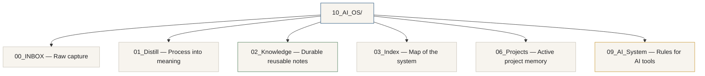

# Folder Structure Diagram

The Local AI Knowledge OS is a small, role-based folder structure. Each folder has one job, so both you and your AI tools always know where to look. This is the layout you copy from [`starter-kit/10_AI_OS/`](../../starter-kit/10_AI_OS/).



Plain-text view:

```text
10_AI_OS/
├── 00_INBOX/      Raw capture — everything lands here first
├── 01_Distill/    Process into meaning
├── 02_Knowledge/  Durable, reusable notes
├── 03_Index/      Map of the system
├── 06_Projects/   Active project memory
└── 09_AI_System/  Rules for AI tools
```

## Why this structure matters

- **Role over topic.** Each folder defines what a file *is* (raw input, distilled meaning, durable knowledge, a map, project state, or AI rules) — not just what it's about. This is what lets an AI navigate it reliably.
- **One job per folder.** Capture, processing, and keeping stay separate, so nothing gets lost between "I wrote it down" and "I can reuse it."
- **Stable, predictable order.** The numbered prefixes keep the layout consistent and leave room to grow (`04_`, `05_`, `07_`, `08_`) without reshuffling.
- **A clear front and back door.** `03_Index` is where you (and an agent) start to orient; `09_AI_System` is where the rules for AI tools live, keeping the OS tool-agnostic.
- **Lightweight and copyable.** It's just folders of Markdown — no app, no database. Copy it once and start using it the same day.

See each folder's README under [`starter-kit/10_AI_OS/`](../../starter-kit/10_AI_OS/) for what belongs where.
