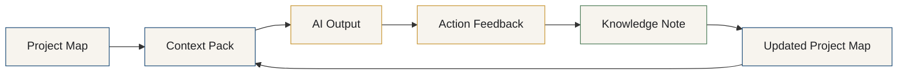

# Project Memory Loop Diagram

This is the core working cycle of the system. You start from a project's current state, brief an AI, act, record what happened, and fold the lesson back in — leaving the project a little smarter than before.

## The steps

1. **Project Map** — the living front door: goal, status, decisions, next actions.
2. **Context Pack** — a focused brief assembled from the map for one task.
3. **AI Output** — what the AI produces from that focused context.
4. **Action Feedback** — an honest record of expected vs. actual result.
5. **Knowledge Note** — the reusable lesson, promoted to durable Knowledge.
6. **Updated Project Map** — state and next actions are refreshed, and the loop continues.

## Why this loop is the core of the system

- **It turns work into reusable memory.** Without the feedback-to-knowledge step, a system only grows bigger; with it, the system gets *better*.
- **It keeps AI grounded.** Each task starts from current project state and a focused pack, so answers stay accurate and consistent across tools.
- **It captures the *why*, not just the *what*.** Decisions and lessons are recorded as you go, so future-you and future-AI don't relitigate settled choices.
- **It's tool-agnostic.** The same loop works whether you use Claude, Codex, ChatGPT, or a local LLM — the model changes, the loop stays.
- **It's lightweight.** Every step is a Markdown file. No app, no database, no automation required to get the benefit.

See it worked end-to-end in the fictional [sample memory loop](../../examples/sample-memory-loop.md).
