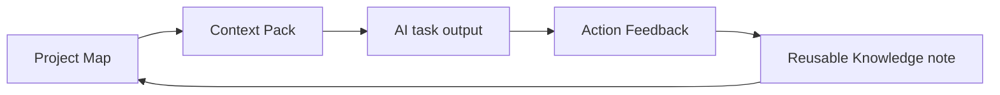

# Sample Memory Loop — Example Local Website Project

> This is a **fictional, public-safe example** showing one complete cycle of the Local AI Knowledge OS, end to end. It ties together the other examples so you can see how the pieces connect. No real customer or private data is included, and no exaggerated success claims are made.

The loop has five steps:



We'll follow one small task — drafting a homepage headline — through the whole loop.

---

## Step 1 — Project Map (the starting state)

The project already has a front door: [sample-project-map.md](sample-project-map.md). The relevant slice:

- **Goal:** publish a small marketing site for a fictional local bakery.
- **Status:** homepage builds locally; final headline copy still needed.
- **Decisions:** static site generator (DR-001); third-party form (DR-003); tone is warm, simple, local.
- **Next action (relevant one):** write the homepage headline.

The Project Map tells us *what's true now* and *what to do next*. That next action becomes a task.

---

## Step 2 — Context Pack (focus the AI)

We turn that next action into a focused brief: [sample-context-pack.md](sample-context-pack.md). It gives the AI only what it needs:

- the goal and current state,
- the decisions to respect,
- the tone notes and relevant files,
- constraints (short, plain, no invented claims),
- the requested output (three headline options),
- success criteria and where to record feedback.

We hand this Context Pack to any AI tool — Claude, Codex, ChatGPT, or a local LLM.

---

## Step 3 — AI task output (summary)

The AI returns three headline options, all in the warm, local tone. Summary of what came back:

- Two options are usable as written.
- One option drifts into a marketing cliché and is set aside.
- The chosen headline gets one small edit to shorten it.

We paste the chosen headline into the homepage draft. (The raw output stays in the project folder; only the summary matters for the loop.)

---

## Step 4 — Action Feedback (what actually happened)

We record the outcome honestly: [sample-action-feedback.md](sample-action-feedback.md). Key points:

- **What worked:** pointing the AI at tone notes and listed decisions kept it on-voice.
- **What failed:** the brief didn't forbid clichés or state where the text appears.
- **Reusable lesson:** name the phrases to avoid and state placement when briefing copy tasks.
- **Next action:** refine the Context Pack guidance before the next copy task.

---

## Step 5 — Reusable Knowledge note (close the loop)

The lesson is promoted into durable Knowledge so it helps every future task:

```markdown
# Briefing AI for copy tasks

When asking an AI for copy:
- Name the clichés and phrases to avoid (not just the desired tone).
- State where the text will appear (section, above/below other elements).
- Keep length limits explicit.

Why: on-tone output improves when "don'ts" and placement are specified,
not just the positive tone direction.
```

Saved as `02_Knowledge/briefing-ai-for-copy-tasks.md` — an example path inside your own OS, not a file in this repository. For a complete, finished Knowledge note you can model yours on, see the [sample Knowledge note](sample-knowledge-note.md).

---

## The loop closes

That Knowledge note now feeds back into the **Project Map** and the next **Context Pack** — so the next copy task starts smarter than this one. We also update the Project Map: mark "write homepage headline" done, and add the headline to the homepage draft.

That's the whole system in one pass:

**Project Map → Context Pack → AI task → Action Feedback → Knowledge → (back to the Project Map).**

Nothing here required a database, an app, or a cloud account — just Markdown files an AI can read, and a habit of closing the loop.
